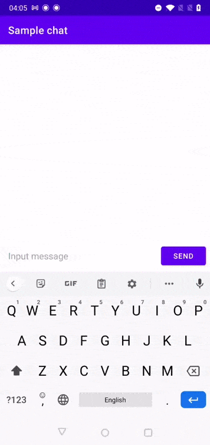
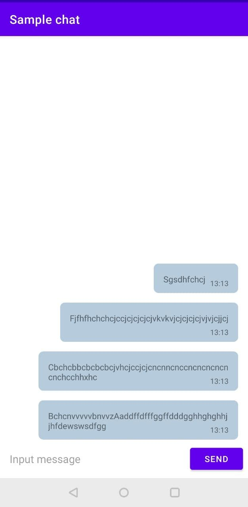

# FlowLayout library

This library allows to implement bubble text messages as in WhatsApp or Telegram.

 

## Installation

FlowLayout is distributed through [Jitpack](https://jitpack.io/#ni032mas/flow-layout).

```groovy

    implementation 'com.github.ni032mas:flow-layout:${LATEST_VERSION}'

```

[](https://jitpack.io/#ni032mas/flow-layout)

## Usage

Wrap view text and view time in a FlowLayout. 

```xml
<com.ni032mas.flowlayout.FlowLayout
        android:id="@+id/flexboxLayout"
        android:layout_width="0dp"
        android:layout_height="wrap_content"
        android:layout_gravity="end"
        android:layout_marginTop="8dp"
        app:viewFlowIn="@+id/textTime"
        app:viewTextIn="@+id/textMessage">

        <TextView
            android:id="@+id/textMessage"
            android:layout_width="wrap_content"
            android:layout_height="wrap_content"
            android:layout_gravity="start|top"
            android:focusableInTouchMode="false"
            android:paddingStart="8dp"
            android:paddingEnd="8dp"
            android:textSize="14sp"
            app:layout_constrainedWidth="true"
            app:layout_constraintBottom_toBottomOf="parent"
            app:layout_constraintEnd_toEndOf="parent"
            app:layout_constraintHorizontal_bias="0.0"
            app:layout_constraintStart_toStartOf="parent"
            app:layout_constraintTop_toTopOf="parent"
            app:layout_constraintWidth_min="wrap"
            tools:text="Hello world!" />


        <TextView
            android:id="@+id/textTime"
            android:layout_width="wrap_content"
            android:layout_height="wrap_content"
            android:layout_gravity="end|bottom"
            android:paddingStart="0dp"
            android:paddingEnd="8dp"
            android:textSize="12sp"
            app:layout_constrainedWidth="true"
            app:layout_constraintBottom_toBottomOf="@+id/textMessage"
            app:layout_constraintEnd_toEndOf="parent"
            app:layout_constraintHorizontal_bias="1.0"
            app:layout_constraintStart_toStartOf="parent"
            app:layout_constraintTop_toBottomOf="@+id/textMessage"
            app:layout_constraintWidth_min="wrap"
            tools:text="10:27 AM" />
    </com.ni032mas.flowlayout.FlowLayout>
```
Specify the viewTextIn for text and viewFlowIn for time in the properties.

```xml
<com.ni032mas.flowlayout.FlowLayout
        android:id="@+id/flexboxLayout"
        android:layout_width="0dp"
        android:layout_height="wrap_content"
        android:layout_gravity="end"
        android:layout_marginTop="8dp"
        app:viewFlowIn="@+id/textTime"
        app:viewTextIn="@+id/textMessage">
        
</com.ni032mas.flowlayout.FlowLayout>
```